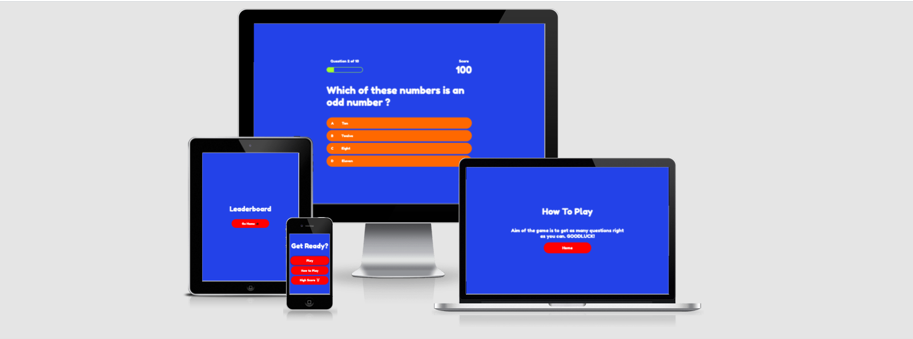
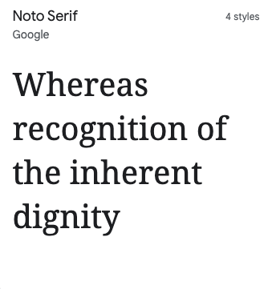
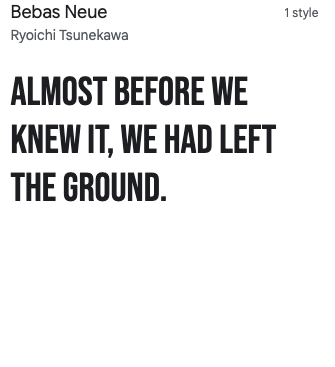
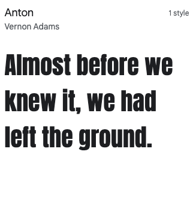
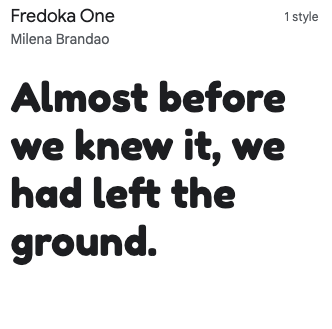
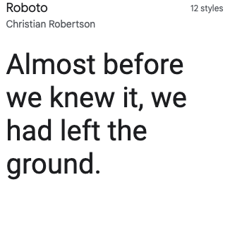
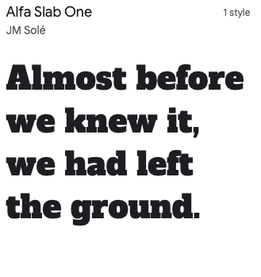
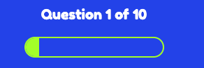
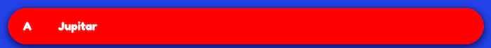

# Guess What Trivia

[View live project here](https://lukesmallman.github.io/Guess-What-Trivia/)

<h2 align="center">

## **Content**

- [**UX (User Experience)**](#ux-user-experience)
  - [**Target Audience**](#target-audience)
  - [**User Stories**](#user-stories)
  
- [**Design Choices**](#design-choices)
  - [**Fonts**](#fonts)
  - [**Colours**](#colours)
  - [**Wireframes**](#wireframes)
  - [**Names**](#names)

- [**Technologies**](#technologies)
  - [**Languages**](#languages)
  - [**Libraries**](#libraries)
  - [**Tools**](#tools)

- [**Features**](#features)
  
- [**Testing**](#testing)
  - [**Performance Testing**](#performance-testing)
  - [**W3C Validator**](#w3c-validator)
  - [**Color Change**](#color-change)

- [**Bugs**](#bugs)

- [**Deployment**](#deployment)
  - [**GitHub**](#github)
  - [**Forking GitHub Repository**](#forking-the-github-repository)
  - [**Making a Local Clone**](#making-a-local-clone)

- [**Credits**](#credits)
  - [**Content**](#content)
  - [**Images**](#images)
  - [**Videos**](#videos)
  - [**Acknowledgements**](#acknowledgements)
  
## **UX (User Experience)**

 ### **Target Audience**

- Range of age groups
- Family game nights

 ### **User Stories**
  - User Goals
    - As a user, I would like to easily navigate through the game without getting confused.
    - As a user, I would like the game to be responsive so that it can be played on different devices.
    - As a user, I would like the game to be interactive.
    - As a user, I want to see a section on how to play the game.
    - as a user, I want to have a section where I can log my highscore.

  - Game Owner Goals
    - The game's goal is to provide challenging questions to test your knowledge.
    - The goal is to add features that will make the game interesting for example:
      - Highscore
      - Question counter
      - Score counter 

[Back to contents](#content)

## **Design Choices**

 ### **Fonts**
  ##### **Fonts**
  
  
  
  
  
  

  - For my font type it was a tricky one as there was so many on google font to choose from. After some testing and thinking I decided to go with Fredoka One as this was the most eye catching and easier to read. I also used san-serif as a backup just in case my font did not load.
  

 ### **Colours**
  ##### **White**
   - White is a sign of simplicity and its clean, These are what im looking for when creating my quiz. Ill be using white for the fonts so that they stand out from other colors.
  ##### **Red**
   - Red is associated with wrong and danger. Ill be using red for my incorrect answers on my questions to inducate that the question the user selected is incorrect.
  ##### **Green**
   - Green is associated with correct and Go. Ill be using green for my correct answers so that it tells the user that the question they have selected is correct.
   - I'll be using green for my progress bar in my quiz as when researching a color most of them where this color. This might change depending on what colors work well together.
  ##### **Blue**
   - This will be a temporary color for my background just to make it easier for me to see my changes.
 ### **Wireframes**
  ##### **Home Page**
   - Web - [view](assets/images/wireframes/home-web.png)
   - Ipad - [view](assets/images/wireframes/home-ipad.png)
   - Iphone - [view](assets/images/wireframes/home-iphone.png)
  ##### **Quiz Page**
   - Web - [view](assets/images/wireframes/quiz-web.png)
   - Ipad - [view](assets/images/wireframes/quiz-ipad.png)
   - Iphone - [view](assets/images/wireframes/quiz-iphone.png)
  ##### **End Page**
   - Web - [view](assets/images/wireframes/end-web.png)
   - Ipad - [view](assets/images/wireframes/end-ipad.png)
   - Iphone - [view](assets/images/wireframes/end-iphone.png)
  ##### **Leaderboard Page**
   - Web - [view](assets/images/wireframes/leaderboard-web.png)
   - Ipad - [view](assets/images/wireframes/leaderboard-ipad.png)
   - Iphone - [view](assets/images/wireframes/leaderboard-iphone.png)
  ##### **How To Play Page**
   - Web - [view](assets/images/wireframes/how-to-play-web.png)
   - Ipad - [view](assets/images/wireframes/how-to-play-ipad.png)
   - Iphone - [view](assets/images/wireframes/how-to-play-iphone.png)
 ### **Names**
  - The Trivia Game
  - Quiz Master
  - Quiz Trivia
  - Guess Trivia
  - Guess What
  - Think
  - Think Trivia
  
  After thinking about this section I decided to go with Guess What as it's catchy and easy to remember.

[Back to contents](#content)

---
## **Technologies**
  
 ### **Languages**
  - [HTML5](https://en.wikipedia.org/wiki/HTML5). 
    - Used for the main markup language for my game content.
  - [CSS3](https://en.wikipedia.org/wiki/CSS). 
    - Used to style my pages and the content on the game.
  - [JS](https://en.wikipedia.org/wiki/JavaScript). 
    - Used to contact the DOM.

 ### **Libraries**
  - [Google Fonts:](https://fonts.google.com/)
    - Google Fonts were used to import the "Oswald" font into the style.css file used on all pages throughout the game.
  - [Font Awesome:](https://fontawesome.com/)
    - Font Awesome was used throughout the website to add icons for aesthetic and UX purposes.
  

 ### **Tools**

  - [Git:](https://git-scm.com/)
    - Git was used for version control by utilizing the Gitpod terminal to commit to Git and Push to GitHub.
  - [GitHub:](https://github.com/) 
    - GitHub is used to store the projects code after being pushed from Git.

[Back to contents](#content)

---
## **Features**
1.  
- This feature will be adding all the correct answers you get throughout the quiz.
2.  
- This feature will keep track of what question you are on durring the quiz.
3.  
- When playing the quiz, if you have a question wrong the box you have selected will turn red to indicate that you had that one wrong.
4.  
- When playing the quiz, if you have a question correct the box you have selected will turn greebn to indicate that you had that one correct.

[Back to contents](#content)

---
## **Testing**
  ### **Performance Testing**
- The website was tested on Google Chrome and Internet Explorer.

- The website was viewed on a variety of devices such as a Desktop , Tablet and Mobile.

- A large ammount of testing was done to make sure all the links worked.

- Friends and family where asked to review the website and give feedback on any changes I could make.

### **W3C Validator**
   - 1. Css - [Results](assets/images/validation/css.png)
   - 2. html - [Results](assets/images/validation/html.png)
   - 3. javascript - Codes were checked using [JSHINT](https://jshint.com/) - there where 2 warning ans these where the Missing semicolon and 'const' is available in ES6 (use 'esversion: 6') or Mozilla JS extensions (use moz).

### **Color change**
 - I decided th change the progress bar as it was the same as the correct color which clashed with eachother. I went with orange as its the same color as the buttons ive been using so wanted to keep a consistency throughout.
 - Ive also kept the color blue for the background as it took me longer that I planned on the javascript side of my quiz app and wanted it to work first before I changed any of the background.

[Back to contents](#content)

---
## **Bugs**
 - The main bug i had on this quiz page was that the score was not submitting on the end page. I had a good look thorugh the code but could not find what the problem was. I tried seeking help but no one got back to me intime so had to leave this out.
 - Another bug I had was the score at the end did not save which I wanted this to work but no one got back to me with a solution so had to also leave this out

[Back to contents](#content)

---
## **Deployment**

 ### **Github**
   - The project was deployed to GitHub Pages as follows:
       1. Log in to GitHub and locate the [GitHub Repository](https://lukesmallman.github.io/pure-fitness/)
       2. Locate the "Settings" button in the menu above the Repository.
          - Alternatively, click [here](https://docs.github.com/en/pages/getting-started-with-github-pages/creating-a-github-pages-site) from the "Creating your site" section for a description of the process.
       3. Scroll down the Settings page until you locate the "Pages" section.
       4. In the "Source" section, select the dropdown "Branch:" dropdown and select "Main".
       5. The page refreshes automatically.
       6. Scroll to "Your site is published at..." for the puslished site link in the "GitHub Pages" section.

  
  ### **Forking the GitHub Repository**
   - A fork is a copy of the original repository on put account so that you can make changes withough effecting the original one.
      1. Log in to GitHub and locate the [GitHub Repository](https://github.com/ElrieM/CI_MS1_MBM)
      2. In the banner above the Repository, click on the "Fork" button.
      3. If you have succeeded, you now have a copy of the original repository in your GitHub account.

  ### **Making a Local Clone**
   1. Log in to GitHub and locate the [GitHub Repository](https://github.com/ElrieM/CI_MS1_MBM)
   2. Click on Code, click on the copy button next to HTTPS to copy the URL. 
   3. Change the current working directory to the location where the cloned directory should be stored.
   4. Type "git clone', then paste the URL copied in step 2.
   5. Press Enter to create a local clone.

[Back to contents](#content)

---
## **Credits**

 ### **Content**
  - https://github.com/LukeSmallman/pure-fitness.git
  - https://codepen.io/trending 

 ### **Images**
   - https://www.cleanpng.com/png-video-cameras-video-production-logo-videography-se-5043403/
   - https://www.pngitem.com/middle/oTxmhT_food-and-drink-icon-png-food-and-drink/
   - https://www.onlinewebfonts.com/icon/511797
   - https://www.kindpng.com/imgv/iwJxiTi_history-icon-vector-clipart-png-download-transparent-png/
   - https://www.flaticon.com/free-icon/sports_196067
   - https://www.nicepng.com/ourpic/u2q8q8y3y3t4w7q8_home-fullscalenano-science-icon/
   - https://www.istockphoto.com/vector/math-icon-vector-sign-and-symbol-isolated-on-white-background-gm1001261186-270663659
   
  ### **Videos**
   - https://www.youtube.com/watch?v=riDzcEQbX6k
   - https://www.youtube.com/watch?v=f4fB9Xg2JEY
   - https://www.youtube.com/watch?v=C7NsIRhoWuE
   - https://www.youtube.com/watch?v=rFWbAj40JrQ 

  ### **Acknowledgements**
   - My mentor for helpful me with feedback and problems.
   - Student support at code institute for their infomation and support.  

[Back to contents](#content)